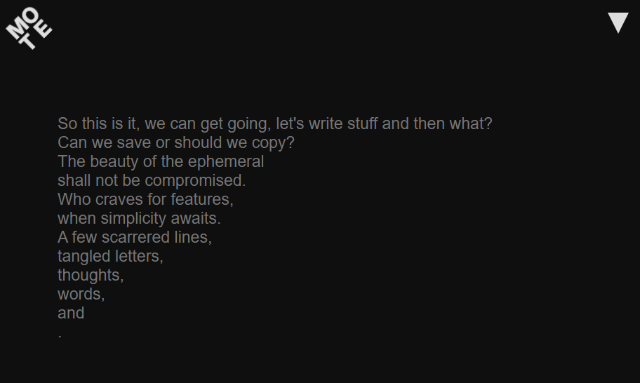

# Minimal Online Text Editor (MOTE)

Ephemeral texts.  
No features.

## Description

A minimalist, distraction-free online text editor inspired by Zen principles. It offers three essential features: a live word counter, automatic text-saving to local storage, and the ability to download your text.

More than a tool, it’s also an art project—a digital installation that explores the harmony between utility and aesthetics on the web.

## License

Copyright (c) Michael Kolesidis  
Licensed under the [GNU Affero General Public License v3.0](https://www.gnu.org/licenses/agpl-3.0.html).
